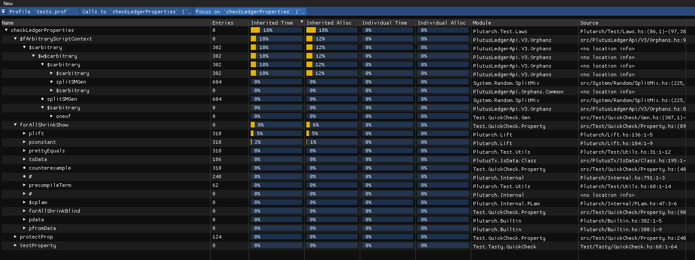

# `imghcprof`

Graphical viewer for GHC `.prof` files



## Usage

```
$ imghcprof [FILES...]
```

### Tips

- Right click on table header to customize columns
- Drag table header to reorder columns
- Right click on any row to open context menu
- Drag window title to move tabs around

## Features

- Fast. Can parse and display ~230MB `.prof` file in under a second on my laptop

## Comparison to Other Tools

Startup time, lower is better.

| Tool                                                     | Time     |
|----------------------------------------------------------|----------|
| [imghcprof](https://github.com/t4ccer/imghcprof)         |   831 ms |
| [profiterole](https://github.com/ndmitchell/profiterole) |  7566 ms |
| [profiteur](http://github.com/jaspervdj/profiteur)       |  7352 ms |
| [ghcprofview](https://github.com/portnov/ghcprofview-hs) | 31000 ms |

Note on methodology, time reported for `imghcprof`, `profiterole`, and `profiteur` is the mean from `hyperfine`. `ghcprofview` was measured by hand. `imghcprof` and `ghcprofview` were measured to first rendered GUI frame. `profiterole` and `profiteur` were measured to produce output file. `imghcprof` was instrumented to exit after first frame. All tools were tested on the same ~230MB prof file.


## Installation

### With `nix`

Prerequisites:
- Enabled flakes

```
$ nix run github:t4ccer/imghcprof [INPUTS...]
```

### With `cargo`

Prerequisites:
- `SDL2`
- `pkg-config`

```
$ cargo build
```
